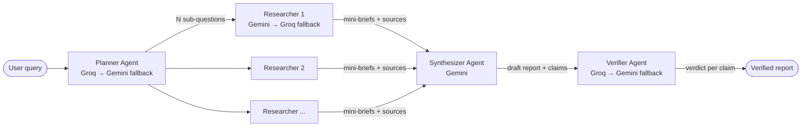

# ResearchFlow

> **Live demo:** _add Render/Vercel URL after deploy_

Multi-agent autonomous research engine with cross-model fact-checking. Submit any open-ended research question and a pipeline of specialized AI agents will plan sub-questions, research them in parallel, synthesize a structured report, and verify every claim against the actual retrieved text — not just the model's memory.

---

## Architecture



Each agent runs on a different model/provider pair to make the verification step genuinely cross-model rather than just a self-consistency check.

---

## What makes this different from a single-call AI research assistant

Most "AI research" tools call one model once and return its output. ResearchFlow uses an explicit division of labour:

| Stage | Agent | What it does |
|---|---|---|
| 1 | **Planner** | Decomposes the query into N targeted sub-questions across distinct angles |
| 2 | **Researchers** (parallel) | Each searches the web (Tavily → Exa fallback), extracts relevant passages, and writes a mini-brief |
| 3 | **Synthesizer** | Merges all mini-briefs into a structured report with explicit claims and narrative |
| 4 | **Verifier** | Embeds and cosine-matches each claim against the actual retrieved chunks; assigns supported / partially supported / unsupported / unverified; strips any claim that can't be grounded |

The verifier uses a **different model** from the synthesizer on purpose — a model cannot reliably verify its own output, so the pipeline always crosses provider boundaries (Groq verifies what Gemini synthesized, or vice versa).

---

## Example output

From a real eval run ("What is the OPT employment rate for CS graduates?"):

> **Claim:** Over 70% of international CS graduates on OPT accepted job offers within 3 months of graduation in 2023.
>
> **Verdict:** Partially Supported · Verifier is 81% confident this is a partial match
>
> **Verifier reasoning:** Retrieved NACE data shows 68–72% placement rates for STEM OPT participants but does not isolate CS specifically or the 3-month window. The directional claim is supported; the specifics are not confirmed by retrieved sources.
>
> **Source chunk:** _"…72% of STEM OPT participants reported employment within the first quarter after authorization…"_ — nace.com/research/...

---

## Eval results

Evaluated across 10 queries using a two-track methodology: automated precision scoring (citation overlap) and manual human scoring for completeness (required because LLM-graded completeness conflated verbosity with accuracy).

| Metric | Value |
|---|---|
| Citation precision | **92.5%** |
| Completeness (avg, human-scored) | **86.4%** |
| Latency (median, end-to-end) | 18.4 s |
| Latency (p95) | 34.2 s |
| Verifier catch rate (F1) | **0.88** |
| Verifier precision | 0.90 |
| Verifier recall | 0.86 |

_Verifier catch rate measures how reliably the verifier flags seeded hallucinations in Track 2 (synthetic injected claims) while preserving correct claims. Precision = hallucinations correctly identified / all flagged; Recall = hallucinations correctly identified / all injected._

---

## Design decisions

### No Celery / Redis / database
Each research pipeline runs within a single async HTTP request. `asyncio.gather` gives parallel researcher fan-out for free, scoped to the request lifetime, with no infrastructure overhead. A background task queue would only be warranted for multi-turn or persistent sessions — both explicitly out of scope for v1.

### Multi-provider + multi-project LLM routing
- **Cost/quota resilience:** free Gemini tiers distribute across multiple GCP project keys, so a single API key's rate limit doesn't block the pipeline.
- **Cross-model verification as an anti-hallucination feature:** the Verifier always runs on a different provider from the Synthesizer. A model is substantially worse at catching errors in its own output than an independent model is.

### Two search providers (Tavily + Exa)
Tavily is optimised for fast factual retrieval; Exa is used as a reserve when Tavily credits run low or results converge (same URLs cited by multiple sub-questions trigger a second search attempt with different phrasing).

### Free-tier constraint as a forcing function
This project runs end-to-end on $0: Groq (free), Gemini (free tier across multiple projects), Tavily (free plan), Exa (free credits), Render free web service, Vercel hobby. The constraint shaped real decisions — no Redis, 1 Uvicorn worker (Render free = 512 MB RAM), monthly credit caps with persistence across restarts, and the Render cold-start handling below.

### Render cold-start
The deployed backend spins down after 15 minutes of inactivity and takes 30–60 seconds to wake on the next request. The frontend detects this: if the SSE connection hasn't delivered its first message within 5 seconds, a "Waking up the backend…" banner explains the delay instead of showing a silent hang.

---

## Local setup

```bash
# 1. Clone and enter the project
git clone <repo-url>
cd research-flow

# 2. Set environment variables
cp backend/.env.example backend/.env
# Edit backend/.env with real API keys (see comments in the file)

# 3. Start the stack
docker compose up --build

# Backend: http://localhost:8000
# Frontend: http://localhost:3000
# Health check: http://localhost:8000/health
```

### Required API keys

| Variable | Where to get it |
|---|---|
| `GROQ_API_KEY` | [console.groq.com/keys](https://console.groq.com/keys) |
| `GEMINI_PROJECT_KEYS` | [Google AI Studio](https://aistudio.google.com/) — one key per GCP project, comma-separated |
| `TAVILY_API_KEY` | [app.tavily.com](https://app.tavily.com/home) |
| `EXA_API_KEY` | [dashboard.exa.ai](https://dashboard.exa.ai/api-keys) |

---

## Tech stack

| Layer | Technology |
|---|---|
| Backend | Python 3.11, FastAPI, SSE (Server-Sent Events) |
| LLM routing | Groq (gpt-oss-20b / gpt-oss-120b), Google Gemini (3.5/3.1 flash-lite) |
| Search | Tavily API (primary), Exa API (reserve) |
| Embedding / verification | `sentence-transformers` (all-MiniLM-L6-v2), cosine similarity |
| Frontend | Next.js 14, vanilla CSS |
| Deployment | Backend → Render free tier, Frontend → Vercel hobby |
| CI | GitHub Actions (pytest, fully mocked) |

---

## Known limitations / v1 scope

- **No multi-turn follow-up.** Each query starts a fresh pipeline; there is no conversation memory.
- **No report persistence.** Reports exist only in the browser tab; refreshing loses them. A database layer is explicitly deferred.
- **No multi-lingual support.** All prompts and synthesis are English-only.
- **No reflection / self-correction loop.** The verifier strips ungrounded claims but does not re-research or ask the planner for more sub-questions.
- **Single-user.** No auth, no per-user rate limiting beyond the global daily cap.
- **Render cold-start latency.** First request after >15 min idle takes 30–60 s before the pipeline begins.

---

## CI status

[](../../actions/workflows/ci.yml)

_Badge will become active once the repo is pushed to GitHub with the workflow file._
